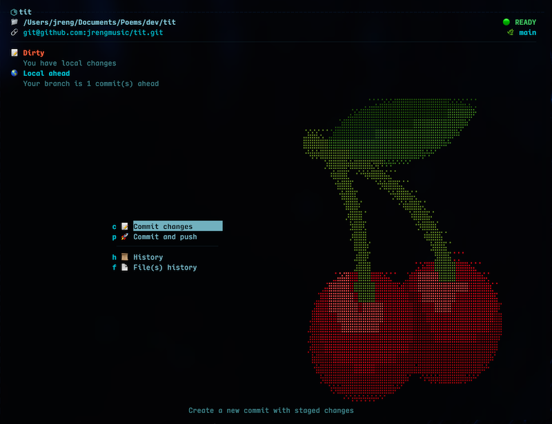

<div align="center">
  
</div>

# TIT — Terminal Interface for git

**I have severe git skills issues.**

I’m sick and tired of wrestling with git commands that fail when I need them most. So I made TIT: a Terminal UI that always shows exactly what is possible based on your actual git state. No surprises. No "command failed" messages. No confusion.

**If it's in the menu, it works. Period.**

---

## TIT Tames the Git Beast

TIT isn’t just a wrapper; it’s a **safety engine**. It’s opinionated about how git should be used so you can focus on code without the command-line anxiety.

### ✅ Zero-Surprise Guarantee
TIT analyzes your repository state across **5 axes** (WorkingTree, Timeline, Operation, Remote, and Environment) before building the menu. If an action appears, it is mathematically guaranteed to succeed. No more `error: cannot push` after you've already committed.

### ⏰ Fearless Time Travel
TIT makes "detached HEAD" state useful rather than terrifying. 
- **Explore:** Jump to any commit to view, build, or test old code in a read-only state.
- **Experiment:** Make local changes while traveling without affecting your branch.
- **Merge Back:** Found a fix in the past? Merge those changes directly back into your current branch with zero friction.

### 🧼 Automatic "Dirty" Operations
Stop managing stashes by hand. If you pull or time-travel with uncommitted changes, TIT automatically snapshots your work, performs the operation, and reapplies your changes on top. If conflicts occur, TIT stops and lets you resolve them immediately.

### ✍🏻 Truth-Preserving History (No Rebase)
TIT is built on the philosophy that history should be the truth, not a sanitized fiction.
- **No Rewriting:** TIT doesn't offer rebase. We don't believe in lying to your timeline.
- **Visual Merging:** Built-in 3-way conflict resolution handles the hard parts of merging safely and visually.
- **Integrity:** Your history tells the story of what actually happened.

---

## Sophisticated Workflow, Simple UI

**🔧 SSH Setup Wizard**  
TIT detects missing SSH keys on first run and walks you through generation and setup for GitHub/GitLab in 30 seconds.

**🎨 Seasonal Themes**  
Visuals matter. TIT includes 5 meticulously hand-picked color palettes (Spring, Summer, Autumn, Winter) that are a sight for sore eyes.

**🔍 3-Pane File History**  
Not just "what changed"—see the Commit list, the Files, and the Actual Diffs in one cohesive view.

**⚡ Live State Engine**  
Background git state detection keeps TIT current. The menu updates automatically when you switch branches or edit files in another terminal.

---

## Get Started

TIT compiles to a single static binary with zero dependencies.

```bash
./build.sh
./tit_x64
```

**Requirements:** Go 1.25+, Git, Terminal (70×30 minimum)

### Controls
| Key | Action |
|-----|--------|
| `↑/k` `↓/j` | Navigate menus |
| `Enter` | Execute (guaranteed success) |
| `Tab` | Switch panes (History/Conflicts) |
| `Esc` | Back / Cancel |
| `Ctrl+R` | **Rewind** (Hard Reset to Commit) |
| `Ctrl+C` | Exit (press twice) |
| `/` | Config Menu |

---

## For Architects & Engineers

TIT follows a strict **Model-View-Update** architecture where the UI is a pure function of the git state.

- **[SPEC.md](SPEC.md)** — The complete technical contract.
- **[ARCHITECTURE.md](ARCHITECTURE.md)** — System design and 5-axis engine details.
- **[CODEBASE-MAP.md](CODEBASE-MAP.md)** — Internal navigation guide.

---

<div align="center">
  
</div>

**TIT: Lightning in a bottle. Because git is thunder.**

---
Rock 'n Roll!

**JRENG!** 🎸
---
conceived with [CAROL](https://github.com/jrengmusic/carol)